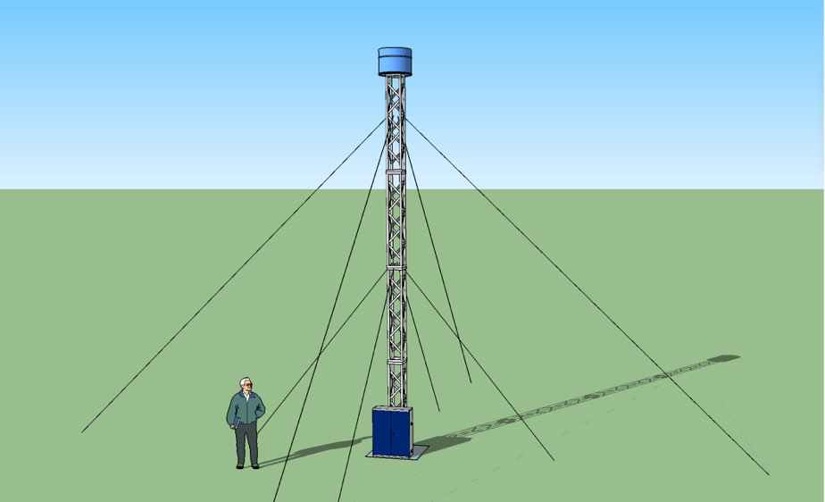

# The Crack Of Dawn

*The Crack Of Dawn* is an art project proposal for Burning Man 2016 - it involves a loud explosion every morning, precisely timed to occur exactly as the first sliver of dawn sun breaches the horizon.

Further details about the project are currently restricted to a small group of contributors, while we complete the prototypes and prepare the safety documentation for the Burning Man Fire Art Safety Team (FAST).

More information will follow as the project progresses.
